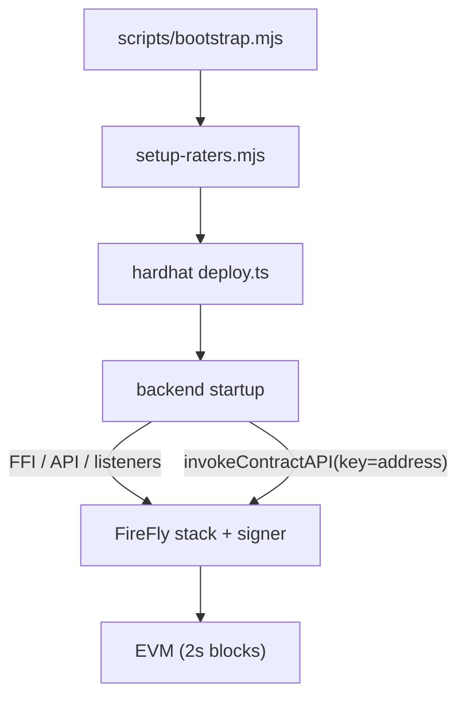

# Blockchain infrastructure

This document describes how the app bootstraps chain infrastructure locally, how keys and signing work, and what would change for a production deployment.

## Local architecture



### One-time bootstrap

After starting the FireFly stack, run:

```bash
npm run bootstrap
```

This script:

1. Creates `backend/config.json` from `config.example.json` if needed
2. Creates admin + rater accounts on the stack and writes addresses to config
3. Compiles, tests, and deploys `MovieRatings`
4. Writes a deployment artifact to `deployments/<stack>.json`

Manual steps are still required once per machine:

```bash
ff init dev-challenge 1 --block-period 2 --multiparty=false -t none --sandbox-enabled=false --firefly-base-port 8000 -m scripts/firefly-manifest-v1.3.2.json
ff start dev-challenge
```

### Runtime startup

When the backend starts it:

1. Loads config from `backend/config.json`, with env var overrides (see `.env.example`)
2. Validates required addresses are present
3. Registers the contract FFI, API, and event listeners with FireFly (idempotent on restart)
4. Subscribes to confirmed blockchain events and forwards them over SSE
5. Exposes REST endpoints including `/api/health` and `/api/operations/:id`

Deploy and account creation are **not** repeated on every backend boot — those are bootstrap concerns.

## Key management

### Current model (custodial, gated)

Private keys live in FireFly's signer. The app only stores **addresses** in config.

| Role | Key location | How the backend signs |
|------|--------------|----------------------|
| Admin | FireFly account 0 | After password login → session token → `key: ADMIN_ADDRESS` |
| Rater | FireFly accounts 1–3 | After rater login → session token → `key: session.address` |

**Improvements over the original demo:**

- Rater endpoints require a session token; you can no longer spoof `{ rater: "alice" }` without authenticating
- Admin password can be set via `ADMIN_PASSWORD` env var instead of config file
- Sessions expire after 24 hours
- `/api/health` reports config and FireFly connectivity issues at startup

**Demo credentials:**

- Admin password: `blockbuster` (or `ADMIN_PASSWORD`)
- Rater passwords: match persona names (`alice`, `bob`, `carol`)

### Production path

For a real network deployment, typical next steps:

1. **User-owned keys** — MetaMask / WalletConnect for raters; backend returns unsigned payloads or uses external signing
2. **Secrets** — admin credentials in a secret manager, not config files
3. **Key separation** — deployer key ≠ admin key; consider multisig for admin
4. **Network config** — chain ID, RPC URL, gas policies, confirmation depth
5. **Deploy pipeline** — CI deploy with verified bytecode; address registry instead of local JSON

The smart contract already enforces `msg.sender` for ratings and admin-only movie adds, so moving to browser-wallet signing for raters would not require contract changes.

## Configuration

| Source | Purpose |
|--------|---------|
| `backend/config.json` | Addresses, rater map, local defaults (gitignored) |
| `.env` / env vars | Secrets and environment overrides |
| `deployments/<stack>.json` | Deploy artifact: contract address, admin, timestamp |

Env vars (see `.env.example`):

- `FIREFLY_HOST`, `FIREFLY_NAMESPACE`, `CONTRACT_VERSION`, `PORT`
- `ADMIN_PASSWORD`
- `MOVIE_RATINGS_ADDRESS`, `ADMIN_ADDRESS` (optional overrides)

## API additions

| Endpoint | Purpose |
|----------|---------|
| `GET /api/health` | FireFly reachability + config validation |
| `GET /api/operations/:id` | Poll FireFly operation status for a submitted tx |
| `POST /api/rater/login` | Authenticate a rater persona; returns signing session token |

Rating submission (`POST /api/movies/:id/ratings`) now requires `Authorization: Bearer <rater-token>` and signs with the authenticated wallet only.

## Testnet considerations

To target a public testnet instead of the local FireFly stack:

1. Add a Hardhat network entry (e.g. Sepolia) with RPC URL and deployer key from env
2. Deploy with `npx hardhat run scripts/deploy.ts --network sepolia`
3. Point `FIREFLY_HOST` at a FireFly instance connected to that network, or replace FireFly signing with direct RPC + wallet connect
4. Fund deployer and admin accounts from a faucet
5. Wait for appropriate confirmation depth before treating ratings as final

The bootstrap script and deployment artifact pattern stay the same; only the network target and key custody model change.
